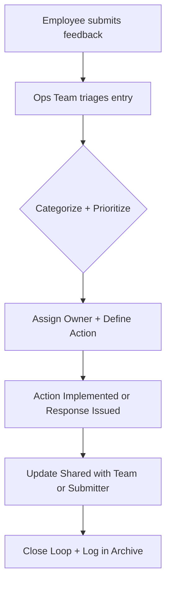

# Feedback Loop Mechanisms: Collecting, Processing, and Acting on Internal Feedback

A structured guide to help internal communication, HR, and leadership teams establish feedback loops that go beyond collection—and close the trust gap by showing meaningful action.

---

## Overview

This guide outlines how to implement **effective internal feedback loops** that foster continuous improvement, build trust, and enhance employee engagement. Feedback loops empower employees to share insights, ensure their voices are heard, and promote visible, organization-wide responsiveness.

---

## Why It Matters

Strong feedback systems are not just operational tools—they’re **trust-building mechanisms** that impact retention, morale, and decision-making. Organizations with clear loops:

- **Detect friction early**
- **Drive team-aligned improvements**
- **Demonstrate that input matters**
- **Avoid redundant or disjointed initiatives**
- **Strengthen cultural credibility**

When feedback is ignored or unstructured, teams disengage. When it’s captured and acted on transparently, organizations evolve with resilience.

---

## Audience and Scope

This guide supports:

- **HR & People Operations Teams** managing culture, engagement, and employee sentiment
- **Internal Communications Teams** promoting feedback channels and outcomes
- **Team Managers & Leaders** implementing and responding to team-level input
- **Project/Product Owners** gathering feedback on tools, platforms, or initiatives
- **Employees** understanding how their input is valued and processed

> This guide is focused on **internal employee feedback**, not customer or external user feedback.

---

## Prerequisites

Before you begin, ensure:

- **Clear Feedback Goals**: What do you want to improve or measure? (e.g., policy clarity, tool usage experience, onboarding effectiveness)
- **Tool Access**: Forms, dashboards, trackers, and analytics must be accessible to admins and feedback owners
- **Ownership Defined**: Assign who collects, triages, communicates, and resolves feedback
- **Trust Policies**: Explain anonymity and how data is handled
- **Leadership Buy-in**: Secure visible commitment from team leads and decision-makers

---

## Instructions

Implement effective internal feedback loops by following these four phases:

### 1. Capture Feedback

Use one or more of the following structured channels:

| Channel                    | Format                              | Best Use Case                                 |
|---------------------------|--------------------------------------|-----------------------------------------------|
| Pulse Surveys             | Short, anonymous                    | Quick mood checks or initiative sentiment     |
| Open Office Hours         | Live with leaders or SMEs           | Direct, candid discussion with leadership     |
| Suggestion Boxes / Forms  | Digital or paper-based              | Continuous idea or issue collection           |
| 1:1 Manager Check-ins     | Regular and personal                | Individual workload, morale, or feedback      |
| Retrospectives            | Structured project/team review      | Improving process after each sprint/phase     |
| Chat Channels (Slack/Teams)| Transparent async discussion       | Fast, inclusive input on active initiatives   |

---

### 2. Analyze Feedback

- **Central Triage Board**: Use Notion, Trello, or Excel to consolidate entries  
- **Categorize**: Tag feedback by type (Policy, Tools, Culture, etc.) and urgency  
- **Sentiment Check**: Use NLP or manual tone scoring  
- **Look for Trends**: Spot repeat issues or opportunities

---

### 3. Act on Feedback

- Assign each entry to an **owner**
- Translate insights into **action items** with deadlines
- **Track** status: To Do → In Progress → Resolved
- Log actions visibly (dashboard, wiki, or shared tracker)

---

### 4. Close the Loop

- **Announce updates** to the team or org
- **Celebrate input** that triggered positive change
- Maintain an **archive** of closed feedback and outcomes

---

## Templates and Snippets

### 📋 Feedback Triage Log (Copy-Paste Table)

```markdown
## Feedback Triage – Q3 Example

| Date       | Source        | Theme            | Description                          | Owner   | Priority | Status      | Notes                         |
|------------|---------------|------------------|--------------------------------------|---------|----------|-------------|-------------------------------|
| 2025-07-01 | Survey         | HR Policy        | Confusing hybrid leave rules         | HR Ops  | High     | In Progress | FAQ page to be updated       |
| 2025-07-03 | Slack Thread   | Tool Usability   | LMS slow during peak hours          | IT      | Medium   | To Do       | Escalated to vendor          |
| 2025-07-05 | Anonymous Form | Expense Process  | Delays in reimbursement approvals    | Finance | Medium   | Resolved    | Workflow revised             |
````

---

### 📣 Feedback Closure Message (Internal Comms Template)

```markdown
📬 **Feedback Update – July**

Thanks to everyone who submitted feedback! Here’s what we heard—and what we’re doing:

- ✨ **LMS Performance:** IT is optimizing backend load times. Updates by July 20.
- ✨ **Expense Delays:** Finance has updated reimbursement workflows. Forms now process in 48 hrs.
- ✨ **Hybrid Leave Confusion:** HR FAQ now includes edge cases and scenarios.

Your input = real change. Keep it coming.
```

---

### 📝 Simple Feedback Form

```markdown
**Feedback Submission**

1. What topic is your feedback about?
   - [ ] Policy
   - [ ] Tools / Systems
   - [ ] Team / Culture
   - [ ] Other

2. What’s your feedback?  
   [Text field]

3. Suggestions (optional):  
   [Text field]

4. Do you want a follow-up?
   - [ ] Yes (include email)
   - [ ] No / Anonymous
```

---

### 📊 Feedback Flow (Mermaid Diagram)



---

## Tools You Can Use

| Purpose                | Tool Suggestions                            |
| ---------------------- | ------------------------------------------- |
| Surveys & Forms        | Typeform, Google Forms, Microsoft Forms     |
| Triage & Tracking      | Notion, Trello, Jira, Asana                 |
| Communication Channels | Slack, Teams, Internal Wiki, Confluence     |
| Dashboard & Updates    | SharePoint, Internal Newsletter, KPI Boards |
| HR Analytics Platforms | CultureAmp, Glint, Peakon                   |

---

## Tips and Best Practices

* **Avoid over-asking.** Survey fatigue kills future response rates
* **Acknowledge all input**, even if action isn’t immediate
* **Keep feedback owners trained** in empathetic and clear responses
* **Use dashboards** to show open and resolved items
* **Celebrate** changes sparked by feedback

---

## Troubleshooting

| Issue                               | Fix                                                                | Risk if Ignored                                  |
| ----------------------------------- | ------------------------------------------------------------------ | ------------------------------------------------ |
| Low participation                   | Clarify purpose, shorten forms, offer anonymity                    | Blind spots in sentiment, disengaged employees   |
| Feedback goes into a “black hole”   | Track publicly, assign owners, close the loop visibly              | Broken trust, disengagement, repeat complaints   |
| Hostile or passive-aggressive input | Focus on root cause, not tone. Train owners in empathetic response | Escalated tensions, perception of poor listening |
| Too much unfiltered feedback        | Set themes per campaign, triage weekly, log into structured format | Overwhelm, no pattern detection                  |
| Lack of action follow-through       | Assign deadlines, use trackers, publish results                    | Cynicism, loss of momentum                       |

---

## Dependencies and Impact Areas

### 🔗 Dependencies

* Feedback collection tools (e.g., Forms, Surveys, Slack)
* Visibility platforms (Intranet, Dashboards, Newsletters)
* Project tracking tools (Jira, Notion, Asana)
* HR policy review systems
* Leadership participation and visibility

### 🌍 Impact Areas

* **Employee Experience & Culture**
* **HR & Organizational Development**
* **Internal Communications**
* **Change Management**
* **Leadership Decision-Making**
* **Tool Adoption and Improvement**
* **Policy Feedback & Process Optimization**

---

## References and Resources

* [Internal Survey Guide](./internal-survey-guide.md)
* [Communication Metrics Dashboard](./communication-metrics-dashboard.md)
* [CultureAmp: Employee Feedback](https://www.cultureamp.com/resources/guides/employee-feedback)
* [Re\:Work by Google – Feedback Principles](https://rework.withgoogle.com/guides/give-effective-feedback/)
* [Microsoft Writing Style Guide – Feedback](https://learn.microsoft.com/en-us/style-guide/a-z-word-list-term-collections/collections/feedback)

---

## Last Updated

**Date:** July 7, 2025
**Maintainer:** Shailesh Rawat (PoeticMayhem)
**Status:** Version 1.0 – Initial release with full framework, templates, and sample flow.
