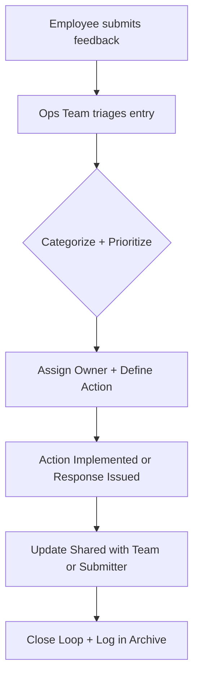

# Feedback Loop Mechanism – Reusable Snippets & Templates

This file includes the key copy-paste blocks, templates, and visual diagrams extracted from the full [Feedback Loop Mechanisms Guide](./feedback-loop-mechanisms.md) for rapid reuse.

---

## 📋 Feedback Triage Log (Markdown Table Template)

```markdown
## Feedback Triage – [Insert Month or Campaign]

| Date       | Source        | Theme            | Description                          | Owner   | Priority | Status      | Notes                         |
|------------|---------------|------------------|--------------------------------------|---------|----------|-------------|-------------------------------|
| YYYY-MM-DD | [Survey / Form / Slack] | [e.g., HR Policy] | [Brief feedback description] | [Team or Person] | [High / Medium / Low] | [To Do / In Progress / Done] | [Any notes] |
````

---

## 📣 Feedback Closure Announcement (Internal Email or Wiki)

```markdown
📬 **[Feedback Campaign Name] – Resolution Summary**

Here’s what we received, and what’s changing as a result:

- ✅ **[Feedback Area #1]:** Action taken or in progress by [Team]. Update by [Date].
- ✅ **[Feedback Area #2]:** Policy/tool/process revised. Details available on [Link].
- ✅ **[Feedback Area #3]:** Initiative added to roadmap for [QX or FY].

Thank you for speaking up. We’ll continue sharing updates regularly.
```

---

## 📝 Minimal Feedback Form Template

```markdown
**Internal Feedback Form**

1. What is the topic of your feedback?
   - [ ] Policy
   - [ ] Tools / Systems
   - [ ] Culture / Team
   - [ ] Other

2. Please describe your feedback:  
   [Text Field]

3. Suggestions (optional):  
   [Text Field]

4. Would you like a follow-up?  
   - [ ] Yes (add email)
   - [ ] No / Anonymous
```

---

## ✅ Feedback Process Comparison – ❌ vs ✅ Table

| **❌ Don't Do This**                          | **✅ Do This Instead**                                                                              |
| -------------------------------------------- | -------------------------------------------------------------------------------------------------- |
| "Email HR if you have feedback."             | "Use the structured HR Feedback Form. It’s reviewed every Friday, and updates are shared monthly." |
| "We collected feedback. Not sure what next." | "All feedback is categorized and triaged. Updates posted weekly on the intranet dashboard."        |

---

## 📊 Mermaid Diagram – Feedback Lifecycle Flow



---

## 🔁 Feedback Loop Lifecycle Summary

**Stages:**

1. **Capture**: Pulse surveys, forms, chat, or meetings
2. **Analyze**: Categorize and detect patterns
3. **Act**: Assign ownership, implement fixes
4. **Close the Loop**: Communicate clearly and transparently

---

## 🛠️ Tools Matrix for Feedback Operations

| Function             | Tools                                   |
| -------------------- | --------------------------------------- |
| Collect Feedback     | Google Forms, Typeform, Microsoft Forms |
| Analyze + Triage     | Notion, Trello, Excel, Jira             |
| Communicate Outcomes | Slack, Teams, Confluence, Newsletters   |
| Archive + Search     | Intranet Pages, Wikis, Shared Drives    |
| HR Analytics         | CultureAmp, Glint, Peakon               |

---

## 📌 Tips for Adaptation

* Embed snippets in your team wiki
* Reuse closure messages for transparency posts
* Build a dashboard from the triage table template
* Store Mermaid diagrams in internal knowledge base for reuse

---

## Last Updated

**Date:** July 7, 2025
**Maintainer:** Shailesh Rawat (PoeticMayhem)
**Version:** v1.0 – Initial snippet compilation for reuse across internal communication workflows.
